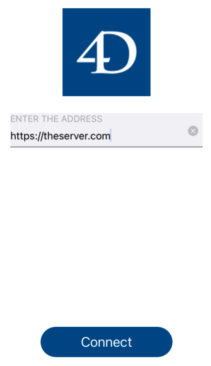

# Enter Server URL

[![Language][swift-shield]][swift-url]
[![check][check-shield]][check-url]

First let user type the server https url of your server.

* **Type:** login

## Requirements

* 4D 19.x submit 268808 minimum

### add this template to your project

Currently it is not possible to select it in projet editor but we could add it manually

* To use a login form template, the first thing you'll need to do is create a YourDatabase.4dbase/Resources/Mobile/form/login folder.
* Then drop the login form folder into it.
* For this template, add `"login":"/enterServerURL"` in the file project.4dmobileapp

<!-- MARKDOWN LINKS & IMAGES -->
<!-- https://www.markdownguide.org/basic-syntax/#reference-style-links -->
[swift-shield]: http://img.shields.io/badge/language-swift-orange.svg?style=flat
[swift-url]: https://developer.apple.com/swift/
[check-shield]: https://github.com/4d-go-mobile/form-login-EnterServerURL/workflows/%E2%9C%85%20check/badge.svg
[check-url]: https://github.com/4d-go-mobile/form-login-EnterServerURL/actions?query=workflow%3A%22%E2%9C%85+check%22
